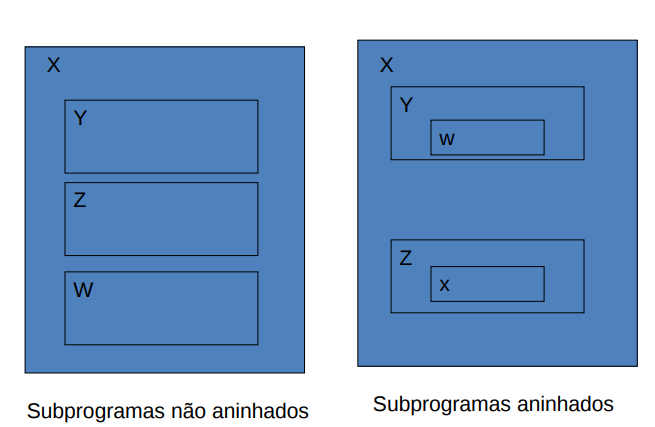
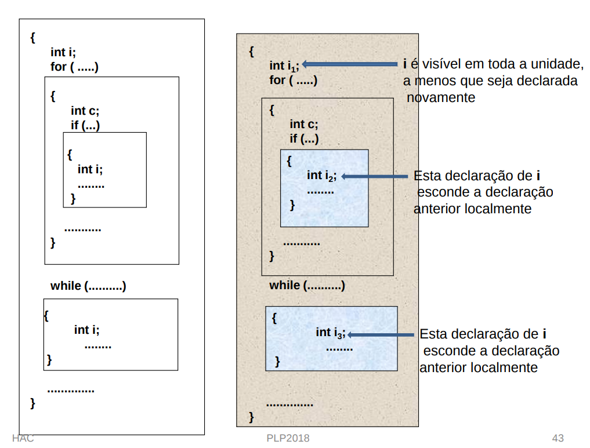
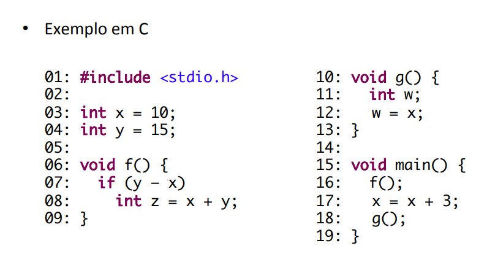
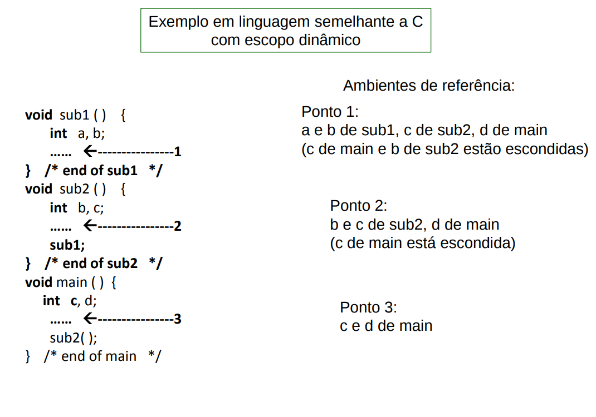
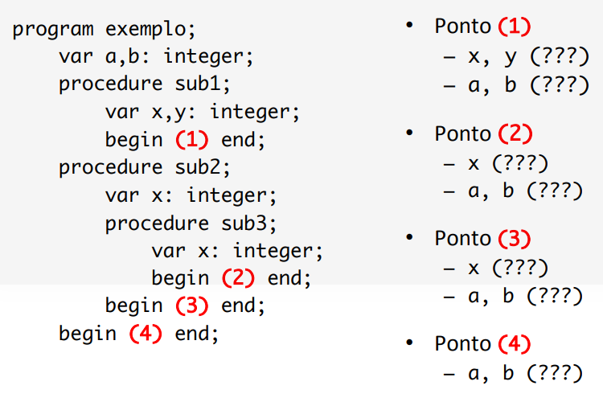

# Resumo P3 PLP
## Programação Estruturada
* Ou linguagens: convencionais, **imperativas ou procedurais**.
* **arquitetura de von Neumann** influencia linguagens (unidade processamento, memória, registradores)
* **Programa estruturado --> pois só lendo o código é possível
saber a sequência com que serão executados os processos ou o que está acontecendo=.**

### Conceitos
- variável, valor e atribuição
- **processamento sequencial**
- programa armazenado
 - **Modelo de máquina:** uma linguagem deve permitir usar diretamente uma máquina orientada por atribuições;

### Vocabulário (termos importantes)
* **Entidade**: variáveis, subprogramas, comandos
* **Atributos** variável (nome, tipo, valor), subprograma (nome, parametros)
* **Amarração:** definição de atributos de entidades. Associação entre entidades  de programação. Ex: uma variável e valor, um identificador e seu tipo.
  * Estática
  * Dinâmica
* **Alocação:**  pegar memória e associa com variável
* **Desalocação:** devolve memória da variável ao pool
* **Variável estática:** alocação antes da execução do programa
  * Variável global
  * Local estática
* **Variável dinâmica de pilha**
  * Ativação
  * Elaboração
  * Execução
* **Variável dinâmica de heap explicíta**: programador faz alocação e desalocação
* **Variável dinâmica de heap implícita:** programador não faz nada
* PAREI TEM QUE CONTINUAR PREENCHENDO

### Variáveis
Abstração de célula(s) de memória --> não é célula física (1byte), célula abstrata tem o tamanho necessário para o tipo da variável.

#### Atributos
* **Nome:** identificador
* **Valor:** conteúdo da célula de memória associado a ela
* **Tipo:** determina intervalo de valores e conjunto de operações disponíveis
* **Endereço:** posição da memória associada. Uma variável pode ter endereços diferentes em momentos diferentes. Variáveis podem ter o mesmo endereço (UNION C --> só um valor na memória de cada vez)
* **Tempo de vida:** intervalo o qual uma área de memória está amarrada a uma variável
* **Escopo:** trecho do programa onde variável é conhecida

### Amarração
Definição de atributos de entidades. Associação entre entidades e seus atributos, especificar atributos de entidade. Ex: uma variável e valor, um identificador e seu tipo.

* **Tempo de amarração** momento em que amarração ocorre. **Diferenciar linguagens**
* **Tipos**

    * **Estática** antes do programa executar, não pode ser mudada
    * **Dinâmica** ocorre em tempo de execução, pode ser mudada

#### Amarração de atributos da variável
* **Valor**: representado de forma codificada na área de memória amarrada. Pode ser uma referência (ponteiro).

```
Amarração dinâmica é mais comum
Soma = 5 //comando de atribuição

Amarração Estática
const n = 50 //Pascal
```

* **Tipo**: intervalos de valores e funções disponíveis

##### Amarração de Tipo Estática
* definida através da declaração de variáveis
```
float x,y; //declaração explicíta
I,J,K,L //Fortran são inteiras, implícita
```

##### Amarração de Tipo Dinâmica
* váriaveis não são declaradas, váriavel pode conter valores de tipos diferentes durante execução;
* não coloco tipo
* tipo é definido quando valor é atribuído a esssa variável.
* **VANTAGENS**: flexibidade programação. Dá pra mudar as coisas mais vezes.
* **DESVANTAGES**:

  * Diminui chances do compilador detectar erros
  * custo mair verificação do tipo em tempo de execução
  * memória é de tamanho variável

* ex: **Javascript**, **python**


continua **Amarração e atributos da variável**
* **Tempo de vida** tempo que uma área de memória está amarrada a uma variável

  * **Alocação** pegar memórias disponíveis de um pool para uma variável
  * **Desalocação** devolve memória que foi desligada da variável para o pool


* **Endereço/Memória**: do ponto de vista de amarração de memória as VARIÁVEIS pode ser:
  - Estáticas
  - Dinâmica de pilha;
  - Dinâmicas de heap explícitas
  - Dinâmicas de heap implícitas

### Tipos de variável (segundo amarração de memória)
#### Variável Estática
* Tempo de vida da variável é até o programa terminar
* Alocação ocorre antes da execução do programa (tempo de compilação), nos casos de :
  * **Variáveis globais** - acessíveis a todo programa
  * **Variáveis Locais estáticas** - acessíveis dentro de subprogramas
* VANTAGENS: eficiência (endereçamento direto), não exige custo adicional para alocação e liberação da memória
* DESVANTAGENS: pouca flexibilidade (não permite subprogramas recursivos), nem compartilhamento de memória (subprogramas que executam em momentos diferentes e tem variáveis grandes)
* Ex:
  * Fortran - tudo era var estáticas
  * C, C++, Java - permite definir variável local estática
  * Pascal - não possui

```
//Em C
//Alocação em tempo de execução
#include <stdio.h>
static char* var = "global";
void main() {
 printf("%s\n", var);
}

Em Java
Em tempo de carregamento da classe
class Foo {
  public static String bar = "foobar";
}
```

#### Variáveis dinâmicas de pilha
* São alocadas da pilha de execução
* QUANDO APARECE
* criadas durante a elaboração de declaração
* alocada à memória no momento da declaração, mas tipo é definido estaticamente
* **Alocação** de memória é feita quando a declaração dessa variável é elaborada, mas o **tipo é amarrado estaticamente**
  * **Elaboração** processo de alocação que acontece no momento em que é iniciada a execução do código onde aparece a declaração da variável (ativação).
  * variáveis declaradas no início do procedimento
  * Ativação --> passa o controle pra quem foi chamado
  * Elaboração --> alocação de memória para função
  * Execução --> volta para quem chamou e libera memória (para que outras funções a use)

```
* P1,P2 e res terão memória alocada na pilha de execução após a chamada da função

int soma(int P1, int P2){
  //soma recebe P1,P2 e retorna um int
  int res;
  res = P1 + P2;
  return(res); //retornando o valor para a unidade que chamou
}

* Variáveis declaradas no início de um comando composto.
A elaboração acontece no início da execução do comando ou no início da execução da unidade.
 main (){
   int i = 0, x = 10;
   while (i++ < 100) {
     float z = 3.34;
  }
}

```

* Em algumas linguagens, variáveis podem ser declaradas em qualquer lugar
* Em algumas implementações, todas as variáveis declaradas em uma função são amarradas a memória no início da execução da função, mesmo que sua declaração não apareçam no começo.

* **A variável se torna visível a partir da sua declaração**
* VANTAGENS:
  * implementa recursão
  * subprogramas usam mesma memória
  * permite compartilhamento de memória

```
// Exemplo
#include <stdio.h>
int soma(int P1, int P2)
{ //soma recebe P1,P2 e retorna um int
 int res;
 res = P1 + P2;
 return(res); //retornando o valor para a unidade que chamou
}
void main()
{
 SOMA(2,10); //memória para parâmetros e res é alocada na pilha de execução
 SOMA(10,20); //memória para parâmetros e res pode ser alocada
 // na mesma posição que a chamada anterior
}
```

* DESVANTAGEM:
  * custo adicional de alocação, não significativo. As variáveis declaradas no início de um subprograma são alocadas juntas.
  * **C, C++, Java - variáveis são dinâmicas de pilha por default**
  * Pascal e ADA - todas as variáveis não heap de subprogramas são dinâmicas de pilha
  * endereçamento indireto


####  Variáveis dinâmicas de heap - explícitas
* alocadas dinamicamente e tamanho não é conhecido estaticamente, por isso usa-se células desorganizadas
*  São alocadas na heap (coleção de células de memória de uso desorganizado), pois é imprevísivel
* alocadas e desalocadas pelo programador durante execuçao do programa
* heap mantém células alocadas dinamicamente e altamente desorganizadas
* pode ser criada e destruída a qualquer momento
* Tempo de vida - enquanto existir referência para variável
* amarraçao estática, armazenamento dinâmico
* Células de memória sem nome são alocadas EXPLICITAMENTE por instruções do programador (chamada de um subprograma).
* linguagens possuem operador para liberar memória (free)
* ponteiros ou variáveis de referência
* **são usadas para implementar estruturas dinâmicas que crescem e diminuem durante execução**

```
C
Funções malloc, calloc e realloc: alocam memória
Função free: libera a memória reservada
void * malloc(int num_bytes);
void free(void * p);
// Exemplo em C
char *ptr;
ptr = malloc (10);
 // aloca memória na heap com o número de bytes
 // especificado – retorna ponteiro para primeira posição
.....
free(ptr)
```

```
C
int *node = malloc(sizeof(int));
/* ... */
free(node);

C++
int* node = new int;
/* ... */
delete node;

Java
Integer node = new Integer(10);
```

```
C++
Operador new –
• Seu operando é um tipo
• Aloca uma posição de memória na heap e retorna um ponteiro para
essa posição
int *intnode; // Cria um ponteiro
intnode = new int; // aloca uma posição de memória na
 // heap do tipo int
....
delete intnode; // desaloca a posição de memória
 // para a qual intnode aponta
C++ tem o operador delete porque não tem liberação de memória
implícita (garbage collection)


int * iPtr = new int[numTests];
 // aloca memória na heap com o número de bytes
 // especificado – retorna ponteiro para primeira posição
.....
 delete [] iPtr;
```


* **Java** --> todos os dados são objetos, dinâmicos de heap e acessados por variáveis de referência. Desalocaçao é feita pelo garbage collection

* VANTAGENS:
  * gestão dinâmica da memória
* DESVANTAGENS:
  * dificultadade de usar corretamente ponteiros
  * custo adicional de referência, alocação e desalocação.


#### Variáveis dinâmicas de heap - implícitas
* São alocados na heap apenas quando valores são atribuídos
* todos os atributos são definidos cada vez que os valores são atribuídos
* programador não faz nada
* VANTAGEM: alta flexibidade do tipo da variável, permite código genéricos
* DESVANTAGENS:
  * custo elevado, todos os atributos são dinâmicos
  * não permite verificação de erros pelo compilador

```
Javascript
Lista = [56.1 7.8 43.5 5.6]
```

**cont. sobre atributos da variável**
### Escopo
* onde variável é visível
* Local e não local

```
#include <stdio.h>
#include <conio.h>
//declaração de variáveis globais
// ---------------- Funçao main()-------------------
int main(void)
{
 //declaração das variáveis locais da main()
 return(0);
}
// -------------------------------------------------
void funcao1(variáveis locais de parâmetros)
{ // declaração das variáveis locais da função1
 return;
}
```
#### Escopo estático (léxico)
* Escopo das variáveis pode ser ESTÁTICO (ANTES DA EXECUÇÃO)
* Amarrações feitas em tempo de compilação
* 2 categorias de ling. com escopo estático:
  * subprogramas podem ser aninhados, criando escopos estáticos aninhados ex: Pascal e Javascript, PHP, C
  * subprogramas não podem ser aninhados, escopos aninhados são criados por classes aninhadas e blocos




* Quando uma variável é referenciada, seus atributos são
determinados pelo comando em que ela é declarada
* Quando uma variável é referenciada em um subprograma, sua
declaração é procurada nesse subprograma.
* Se não for encontrada, a busca continua no subprograma onde
esse mais interno foi definido (pai estático), e assim por diante.




```
Em C
#include <stdio.h>
void main() {
  int i = 0;
  int x = 10;
  while (i++ < 100) {
    float x = 3.231;
    printf("x = %f\r\n", x * i);
  }
}
```

(



##### Regras de escopo
* Uma variável é visível na unidade em que foi declarada
e nas internas, a menos que tenha sido redefinida.
* Uma nova declaração da mesma variável em uma
unidade mais interna **esconde a definição anterior**;
* Em ADA, variáveis escondidas, de escopos mais gerais,
podem ser acessadas com referências seletivas: P1.x

##### Blocos (seções de código)
* Algumas linguagens permitem que blocos tenham suas variáveis Locais
* são variáveis dinâmicas de pilha
* em C blocos estão entre { }
* **Escopos criados por blocos, que podem estar aninhados, são tratados
exatamente da mesma maneira que aqueles criados por subprogramas.**
* Algumas ling. C++ e Java, permitem que variáveis sejam definidas em qualquer lugar do bloco

```
01: int a = 13;
02: void f() {
03: int b = a; // Referência à variável do ponto 1
04: int a = 2;
05: b = b + a; // Referência à variável do ponto 4
06: }
```

* O escopo dessas variáveis é do ponto em que são
definidas até o final do bloco (ou função) em que
aparecem.

#### Escopo global
* variáveis definidas fora das funções
* visíveis em todas as Funções
* C, C++, PHP, Python
* ** Uma variável global em C é implicitamente visível em todas as funções subsequentes do arquivo, exceto naquelas que tem uma definição local para uma variável com mesmo nome**

#### Amarração Dinâmica a escopo --> importante pra caramba SERÁ QUE É ESCOPO DINÂMICO, pelo vi é sim ??
* O escopo é definido em função da execução do programa. O efeito de uma declaração se estende até que uma nova declaração com o mesmo nome seja encontrada.


#### Escopo Dinâmico

* Vai tendo escopo do último lugar que foi chamado
* Baseado na sequência de ativação (chamadas) do programa
* amarrações em tempo de execução
* DESVANTAGENS
  * verificação de tipos em tempos de execução;
  * pouca legibilidade;
  * acesso lento a variáveis não locais
  *



**REFERENTE A IMAGEM ANTERIOR IMPORTANTÍSSIMO** -->
  * As referências a um identificador não podem ser identificadas na compilação
  * Sequência - big, sub2, sub1 --> a referência a x em sub1 é ao X declarado em sub2
  * Sequência - big - sub1 --> a referência a x em sub1 é ao x declarado em big

### Ambiente de referência
* É a coleção de todas as variáveis que são visíveis no comandos
* O ambiente de referência de um comando em
uma linguagem de escopo estático é formado
pelas variáveis declaradas no seu escopo local
mais as declaradas nos escopos ancestrais que
são visíveis
* Conjuntos de todos os nomes visíveis em uma determinada instrução ou ponto do programa





